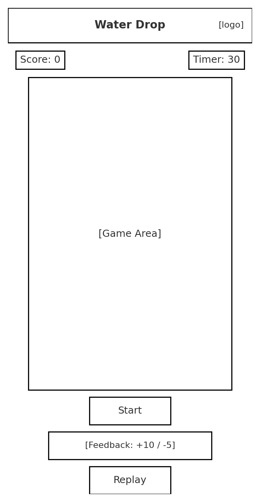

# 💧 Water Drop: Clean Water Challenge  

*A simple HTML/CSS/JS game inspired by [charity: water](https://www.charitywater.org) to raise awareness about the importance of clean water access.*  

[](https://cashmerecode.github.io/charitywater-drop-game/)

---

## 🎮 About the Game  
**Water Drop** is a quick, interactive browser game where players:  
- Collect **clean water drops** (+10 points)  
- Avoid **polluted drops** (–5 points, or –2 if they hit the ground)  
- Race against a **30-second timer**  
- Get instant **visual feedback** (+10 green popups, –5 red popups)  
- Replay to improve their score and learn more about clean water challenges  

This project was created as part of **Project 4 | charity: water Game Concept**.  

---

## ✨ Features  
- Pure **HTML, CSS, and JavaScript** (no frameworks required)  
- **Responsive design** (desktop & mobile layouts)  
- Score counter and countdown timer  
- Feedback messages for good/bad catches  
- Replay option to try again  
- **Brand-inspired palette** (charity: water yellow + blue)  
- Link to [charitywater.org](https://www.charitywater.org) at game end  

---

## 🖼 Screenshots / Wireframes  

### Responsive Layout  
  

*(Replace these with actual gameplay screenshots once deployed wireframes included for now.)*  

---

## 🚀 Getting Started  

### Run Locally  
Clone the repository and open in your browser:  
```bash
git clone https://github.com/cashmerecode/charitywater-drop-game.git
cd charitywater-drop-game
